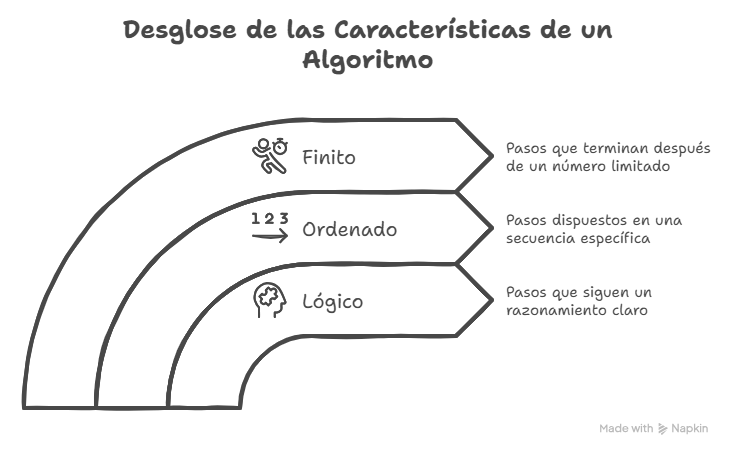

# Módulo 1: Introducción a los Algoritmos y PSeInt

## Teoría

¡Bienvenido/a al mundo de la programación con PSeInt! Antes de escribir código complejo, debemos entender los fundamentos: qué es un algoritmo y cómo PSeInt nos ayuda a crearlos.

### 1. ¿Qué es un Algoritmo?

Piensa en un algoritmo como una **receta de cocina** o un **manual de instrucciones**. Es una secuencia de pasos **lógicos, ordenados y finitos** que describen exactamente cómo resolver un problema o realizar una tarea.



**Características clave de un algoritmo:**

*   **Preciso:** Cada paso debe estar claramente definido, sin ambigüedad.
*   **Definido:** Si sigues el algoritmo varias veces con los mismos datos de entrada, siempre obtendrás el mismo resultado.
*   **Finito:** El algoritmo debe terminar después de un número finito de pasos. No puede quedarse en un bucle infinito.


### 2. ¿Qué es el Pseudocódigo?

El pseudocódigo es una forma de describir los pasos de un algoritmo utilizando un lenguaje **intermedio** entre el lenguaje humano natural y un lenguaje de programación real (como Java, Python, C++, etc.).

**Ventajas:**

*   Se enfoca en la **lógica** del problema, no en la sintaxis estricta de un lenguaje específico.
*   Es más fácil de leer y entender que el código de programación real para los principiantes.
*   Facilita la posterior traducción a cualquier lenguaje de programación.

### 3. Introducción a PSeInt

PSeInt es una herramienta fantástica diseñada para **aprender los fundamentos de la programación y el desarrollo de la lógica**. Nos permite escribir algoritmos en pseudocódigo (en español) y ejecutarlos para ver cómo funcionan.

**Interfaz Principal:**

*   **Área de Edición:** Donde escribes tu pseudocódigo.
*   **Botones de Ejecución:** El botón verde (▶️) ejecuta el algoritmo completo. El botón con los "pies" permite la ejecución **paso a paso**, lo cual es ¡muy útil! para entender el flujo.
*   **Panel de Variables (opcional):** Puede mostrar el valor de las variables mientras el algoritmo se ejecuta.
*   **Área de Salida:** Donde ves los mensajes que tu algoritmo muestra (`Escribir`) y donde ingresas datos cuando el algoritmo los pide (`Leer`).

### 4. Estructura Básica en PSeInt

Todo algoritmo en PSeInt comienza con la palabra clave `Proceso` (o `Algoritmo`, según la configuración) seguida de un nombre descriptivo, y termina con `FinProceso` (o `FinAlgoritmo`).

```pseudocode
Proceso MiPrimerAlgoritmo
    // Aquí van las instrucciones
FinProceso
```

### 5. Comentarios

Los comentarios son líneas que PSeInt ignora al ejecutar el algoritmo. Se usan para explicar partes del código, hacerlo más legible o dejar notas. Se escriben usando doble barra `//`.

```pseudocode
Proceso EjemploComentarios
    // Esto es un comentario de una sola línea.
    Escribir "Hola"; // Esto también es un comentario, al final de una instrucción.
FinProceso
```

### 6. Instrucciones Básicas: `Escribir` y `Leer`

*   **`Escribir`:** Muestra mensajes o el valor de las variables en la pantalla (en el área de salida de PSeInt). Puedes mostrar texto fijo (entre comillas) o el contenido de variables. Para mostrar varios elementos, sepáralos con comas.

    ```pseudocode
    Proceso EjemploEscribir
        Definir saludo Como Caracter;
        saludo <- "Mundo";
        Escribir "Hola ", saludo, "!"; // Muestra: Hola Mundo!
        Escribir 123; // Muestra: 123
    FinProceso
    ```
*   **`Leer`:** Detiene la ejecución del algoritmo y espera a que el usuario ingrese un dato por teclado y presione Enter. Ese dato se guarda en la variable especificada.

    ```pseudocode
    Proceso EjemploLeer
        Definir nombreUsuario Como Caracter;
        Escribir "Por favor, introduce tu nombre:";
        Leer nombreUsuario; // Espera a que el usuario escriba algo y lo guarda en nombreUsuario
        Escribir "Bienvenido/a, ", nombreUsuario;
    FinProceso
    ```

### 7. Variables y Tipos de Datos

Una **variable** es como una caja con una etiqueta donde podemos guardar información (datos) que puede cambiar durante la ejecución del algoritmo.

*   **Declaración:** En PSeInt (especialmente en modo estricto), es buena práctica declarar las variables antes de usarlas, indicando su nombre y qué tipo de dato guardarán. Se usa la palabra clave `Definir`.

    ```pseudocode
    Definir edad Como Entero;
    Definir precio Como Real;
    Definir letraInicial Como Caracter;
    Definir estaActivo Como Logico;
    ```
*   **Tipos de Datos Fundamentales:**
    *   `Entero`: Números enteros (sin decimales), ej: `-5`, `0`, `25`.
    *   `Real`: Números con decimales, ej: `3.14`, `-0.5`, `10.0`.
    *   `Caracter`: Un solo carácter o una cadena de texto, ej: `"a"`, `"Hola Mundo"`.
    *   `Logico`: Solo puede contener dos valores: `Verdadero` o `Falso`.

### 8. Operador de Asignación (`<-`)

Se utiliza para guardar un valor en una variable. La flecha `<-` indica que el valor de la derecha se almacena en la variable de la izquierda.

```pseudocode
Proceso EjemploAsignacion
    Definir contador Como Entero;
    Definir mensaje Como Caracter;

    contador <- 0; // Guarda 0 en contador
    mensaje <- "Inicio"; // Guarda "Inicio" en mensaje

    Escribir mensaje, ": ", contador; // Muestra: Inicio: 0

    contador <- contador + 1; // Actualiza el valor de contador
    mensaje <- "Actualizado";

    Escribir mensaje, ": ", contador; // Muestra: Actualizado: 1
FinProceso
```

---

## Ejercicios del Módulo 1

A continuación, encontrarás los enlaces a los ejercicios prácticos de este módulo. Cada uno incrementa ligeramente la dificultad e incluye errores comunes para que aprendas a identificarlos y corregirlos.

1.  [Ejercicio 1 (Dificultad 1): Hola Mundo](./m1-ejercicio1-1.md)
2.  [Ejercicio 2 (Dificultad 2): Eco de Entrada](./m1-ejercicio2-2.md)
3.  [Ejercicio 3 (Dificultad 3): Suma de Constantes](./m1-ejercicio3-3.md)
4.  [Ejercicio 4 (Dificultad 4): Área de un Rectángulo](./m1-ejercicio4-4.md)
5.  [Ejercicio 5 (Dificultad 5): Saludo Personalizado](./m1-ejercicio5-5.md)
6.  [Ejercicio 6 (Dificultad 6): Intercambio de Variables](./m1-ejercicio6-6.md)
7.  [Ejercicio 7 (Dificultad 7): Promedio de Dos Números](./m1-ejercicio7-7.md)
8.  [Ejercicio 8 (Dificultad 8): Variable Lógica (Mayor de Edad)](./m1-ejercicio8-8.md)
9.  [Ejercicio 9 (Dificultad 9): Concatenar Nombre y Apellido](./m1-ejercicio9-9.md)
10. [Ejercicio 10 (Dificultad 10): Cálculo Simple de Venta](./m1-ejercicio10-10.md)

**¡Mucha suerte y a practicar!**

